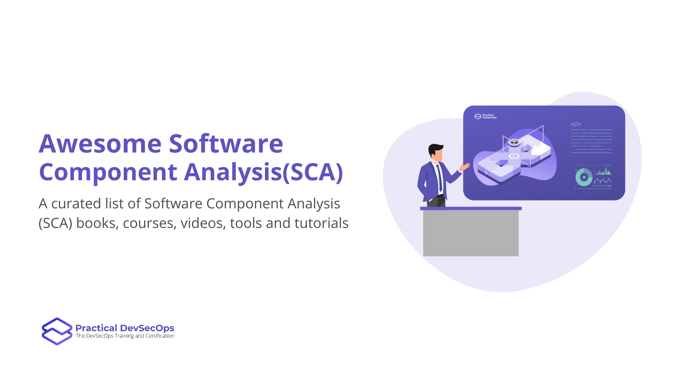

# Awesome Software Component Analysis(SCA)

A curated list of Software Component Analysis (SCA) books, courses - free and paid, videos, tools and tutorials. SCA is a technique to find third party vulnerable components used in your  code.

Contributions welcome. Add links through pull requests or create an issue to start a discussion.

# Table of Contents
- [Books](#books)
- [Articles](#articles)
- [Courses](#courses)
- [Free Tools](#free-tools)
- [Commercial Tools](#commercial-tools)
- [Vulnerability Databases](##vulnerability-databases)
- [References](#References)
- [Credits](#credits)
- [Contributing](#contributing)

## Books
* [Securing Open Source Libraries](https://www.safaribooksonline.com/library/view/securing-open-source/9781491996980/) By Guy Podjarny

## Articles
* [Component Analysis from OWASP](https://owasp.org/www-community/Component_Analysis)

## Courses and Training

*Courses/videos on SCA.*

### Free

- [Software Composition Analysis Deep Dive by Ulisses Albuquerque](https://www.youtube.com/watch?v=F2FfaSX_55A)

### Paid

- [DevSecOps Professional by Practical DevSecOps](https://www.practical-devsecops.com/certified-devsecops-professional/)
- [SANS 540 - Cloud Security and DevSecOps Automation](https://www.sans.org/cyber-security-courses/cloud-security-devsecops-automation/)

## Free Tools

### Javascript

Client Side Libraries - [Retire.js](https://github.com/RetireJS/retire.js)

Backend Libraries - [NPM Audit](https://docs.npmjs.com/cli/v7/commands/npm-audit)

### Ruby
* [bundler-audit](https://github.com/rubysec/bundler-audit)

### Java
* [Dependancy-Check](https://github.com/jeremylong/DependencyCheck)

### Python
* [Safety from Pyup](https://github.com/pyupio/safety)

### PHP
* [Local PHP Security Checker](https://github.com/fabpot/local-php-security-checker)

### Golang
* [Nancy](https://github.com/sonatype-nexus-community/nancy)

### .Net

* [dotnet CLI](https://devblogs.microsoft.com/nuget/how-to-scan-nuget-packages-for-security-vulnerabilities/#dotnet-cli)
* [Dependancy-Check](https://github.com/jeremylong/DependencyCheck)
* [WhiteSource Bolt](https://www.whitesourcesoftware.com/free-developer-tools/bolt/) (Free offering that currently works within Azure DevOps or GitHub)

## Commercial Tools

Most commercial SCA tools support multiple programming languages like Java, Python, Ruby, Go, PHP,.NET,Scala and license scans.

* [Snyk](https://snyk.io/)
* [SourceClear](https://www.sourceclear.com/)
* [Sonatype](https://www.sonatype.com/)
* [BlackDuck](https://www.blackducksoftware.com/solutions/application-security)
* [Contrast Security](https://www.contrastsecurity.com/interactive-application-security-testing-iast)
* [WhiteSource](https://www.whitesourcesoftware.com/whitesource-languages/)
* [Whitehat SCA](https://www.whitehatsec.com/products/static-application-security-testing/software-composition-analysis/)
* [Debricked](https://debricked.com/)

## SCA Vulnerability Databases

* [National Vulnerability Database](https://nvd.nist.gov/)
* [Snyk Vulnerabilitydb](https://github.com/snyk/vulnerabilitydb)
* [VulnDB Data Mirror](https://github.com/stevespringett/vulndb-data-mirror)
* [NIST Data Mirror](https://github.com/stevespringett/nist-data-mirror)
* [Exploit Database](https://www.exploit-db.com/webapps/) 

## Credits

* This repo is based on the original work done by our friend [@raghunath24](https://github.com/raghunath24)

## Sponsor

## Contributing

Please refer the guidelines at [contributing.md for details](Contributing.md).